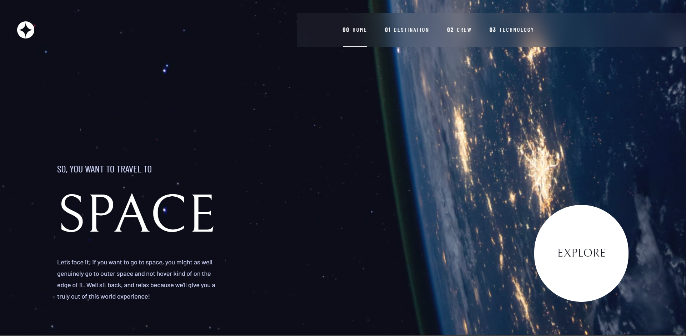

# Frontend Mentor - Space tourism website solution

## Table of contents

- [Frontend Mentor - Space tourism website solution](#frontend-mentor---space-tourism-website-solution)
  - [Table of contents](#table-of-contents)
  - [Overview](#overview)
    - [The challenge](#the-challenge)
    - [Screenshot](#screenshot)
    - [Links](#links)
  - [My process](#my-process)
    - [Built with](#built-with)
  - [Author](#author)
  - [essentials](#essentials)
    - [Setup](#setup)
    - [Development Server](#development-server)
    - [Production](#production)

## Overview

### The challenge

Users should be able to:

- View the optimal layout for each of the website's pages depending on their device's screen size
- See hover states for all interactive elements on the page
- View each page and be able to toggle between the tabs to see new information

### Screenshot

(./screenshot.jpg)

### Links

- Solution URL: [space-tourism-website-code](https://github.com/Wong0790/space-tourism-website)
- Live Site URL: [wong0790-space-tourism.netlify.app](https://wong0790-space-tourism.netlify.app)

## My process

### Built with

- Semantic HTML5 markup
- Tailwind-CSS custom properties
- Flexbox
- CSS Grid
- Mobile-first workflow
- [Tailwindcss](https://tailwindcss.com/) - For styles
- [Pinia](https://pinia.vuejs.org/) - For state management

## Author

- Frontend Mentor - [@Wong0790](https://www.frontendmentor.io/profile/Wong0790)
- Linkedin - [Anneris Wong Jorge](https://www.linkedin.com/in/anne-wong0790)
- Github - [Anneris Wong Jorge](https://github.com/Wong0790)

## essentials

#### Setup

Make sure to install the dependencies:

```bash
# npm
npm install

# pnpm
pnpm install

# yarn
yarn install

# bun
bun install
```

### Development Server

Start the development server on `http://localhost:5173`:

```bash
# npm
npm run dev

# pnpm
pnpm run dev

# yarn
yarn dev

# bun
bun run dev
```

### Production

Build the application for production:

```bash
# npm
npm run build

# pnpm
pnpm run build

# yarn
yarn build

# bun
bun run build
```

Locally preview production build:

```bash
# npm
npm run preview

# pnpm
pnpm run preview

# yarn
yarn preview

# bun
bun run preview
```
